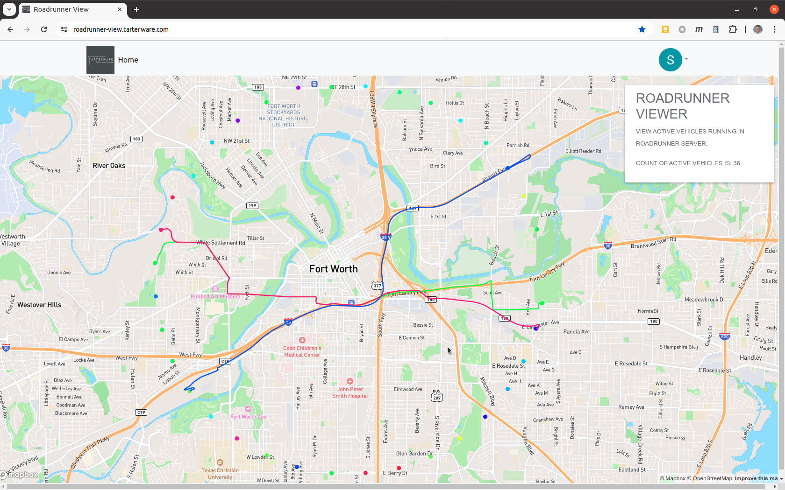

# Roadrunner View

Provides an interface to visualize Vehicles travelling in the roadrunner system.

## Description

Provides an interface to visualize Vehicles travelling in the roadrunner system.

This is a companion project of Roadrunner.

Here's an example of a run of a "criss-cross" pattern of 36 vehicles, starting at bearings spaced 10 degrees, centered around the Fort Worth convention center:

## Setup environment

The application has integrations with OAuth for authentication and MapBox for map displays and georeferencing.  Signup for an Auth0 account at https://auth0.com/.  Signup for a MapBox account at https://account.mapbox.com/auth/signup/ .

The following environment variables need to be set for the application to startup:

* REACT_APP_ROADRUNNER_REST_URL_BASE : Base REST URL of the Roadrunner application (ex:"http://localhost:8080")
* REACT_APP_PUBLIC_URL : (ex:"http://localhost:3000")
* REACT_APP_AUTH0_DOMAIN : Auth0 Domain
* REACT_APP_AUTH0_CLIENT_ID : Auth0 Client ID
* REACT_APP_AUTH0_CLIENT_SECRET : Auth0 Client Secret 
* REACT_APP_AUTH0_CALLBACK_URL : "http://localhost:3000"
* REACT_APP_AUTH0_AUDIENCE : "https://auth.tarterware.com/"
* REACT_APP_MAPBOX_TOKEN :  Token from your Mapbox account
* REACT_APP_MAPBOX_MAP_STYLE : Mapbox style (ex: "mapbox://styles/mapbox/streets-v12")
* REACT_APP_MAPBOX_API_URL : URL to MapBox API (should be "https://api.mapbox.com/")

In my development environement, all but the last three variables reside in the .env file in the root directory of the project.  The sensitive keys appearing in the last three lines above are included via a .env.local file during development.  (Note that this file is explicitly excluded from git in the .gitignore file).

## Run it

    git clone https://github.com/SteveTarter/roadrunner-view.git

    cd roadrunner-view
    npm install
    npm start

    open http://localhost:3000/

