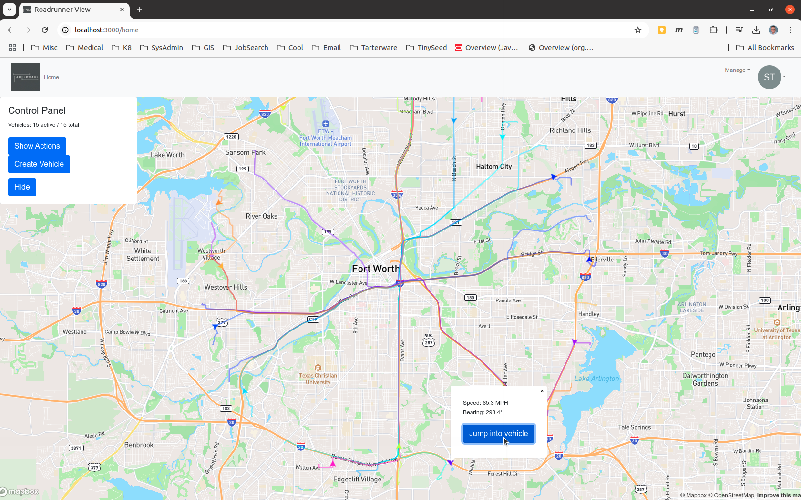
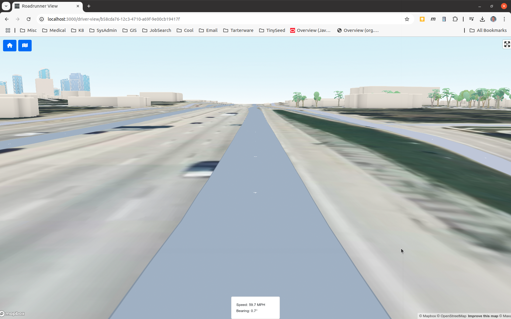

# Roadrunner View

Provides an interface to visualize Vehicles travelling in a Roadrunner system.

## Description

Provides an interface to visualize Vehicles travelling in a Roadrunner system.

This is a companion project of Roadrunner, which provides the server that keeps track of all of the vehicles.  Find it on GitHub at [SteveTarter/roadrunner](https://github.com/SteveTarter/roadrunner).

There is also a Terraform project that provides Terraform scripts and instructions to deploy the Roadrunner application to Kubernetes on either an AWS EKS cluster or a Minikube setup.  Find it on GitHub at [SteveTarter/roadrunner-k8s-orchestration](https://github.com/SteveTarter/roadrunner-k8s-orchestration).

## Features and Examples

Below is an example of a "criss-cross" pattern of 15 vehicles centered around the Fort Worth convention center.  The vehicles are spaced apart by 24 degrees of bearing, at a distance of 10 kilometers from the convention center.  Each vehicle's route takes it to the opposite side of the city at 10 kilometers range.  Here's a view with the routes turned on for all vehicles:


<br><br>

Next, an example of the driver's view.  Mapbox has terrain, as well as some nice, built-in 3D models for all of the buildings in the OpenStreetMap DB.  Even better, they feature enhanced models for some landmark buildings.  The skyline of downtown Fort Worth, Texas is seen on the left side of this display:


<br><br>

I've posted a video to YouTube showing Roadrunner in action.  View it at: 
[RoadRunner Demo (2025-01-02)](https://www.youtube.com/watch?v=KXWTssUFjS0)
<br><br>

## Setup environment

The application has integrations with OAuth for authentication and MapBox for map displays and georeferencing.  Signup for an Auth0 account at https://auth0.com/.  Signup for a MapBox account at https://account.mapbox.com/auth/signup/ .

The following environment variables need to be set for the application to startup:

* REACT_APP_ROADRUNNER_REST_URL_BASE : Base REST URL of the Roadrunner application (ex:"http://localhost:8080")
* REACT_APP_PUBLIC_URL : (ex:"http://localhost:3000")
* REACT_APP_AUTH0_CALLBACK_URL : "http://localhost:3000"
* REACT_APP_AUTH0_AUDIENCE : Auth0 API URL
* REACT_APP_MAPBOX_API_URL : URL to MapBox API (should be "https://api.mapbox.com/")
* REACT_APP_LANDING_PAGE_URL : URL to go to when logginf out
* REACT_APP_MAPBOX_TOKEN :  Token from your Mapbox account
* REACT_APP_AUTH0_CLIENT_ID : Auth0 Client ID
* REACT_APP_AUTH0_CLIENT_SECRET : Auth0 Client Secret 
* REACT_APP_AUTH0_DOMAIN : Auth0 Domain

In my development environement, all but the last four variables reside in the .env file in the root directory of the project.  The sensitive keys appearing in the last four lines above are included via a .env.local file during development.  (Note that this file is explicitly excluded from git in the .gitignore file).

## Run it

First, make sure that you have an instance of Roadrunner executing [SteveTarter/roadrunner](https://github.com/SteveTarter/roadrunner).
First, obtain the repository and descend into the directory:

```bash
    git clone https://github.com/SteveTarter/roadrunner-view.git
    cd roadrunner-view
```

Update the .env and .env.local files to point to your Mapbox keys, Auth0 resources, and local resources.  Next, compile and run:

```bash
    npm install
    npm start
```

The browser will most likely open on npm start, if not, then execute:

```bash
    open http://localhost:3000/
```
